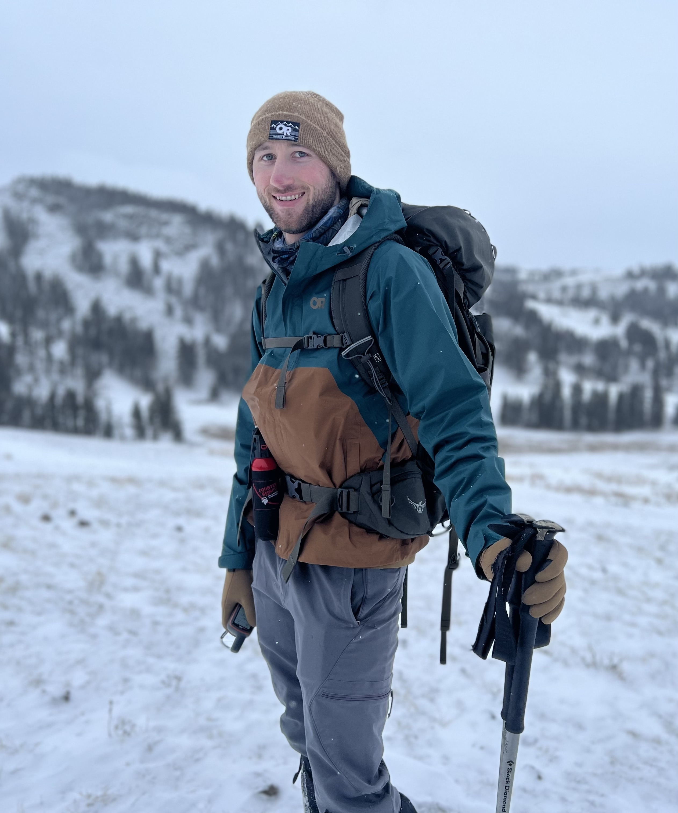

Aside
================================================================================

{width=80%}

Contact Info {#contact}
--------------------------------------------------------------------------------

- <i class="fa fa-envelope"></i> rabe0092@umn.edu
- <i class="fa fa-github"></i> [github.com/jrabe21](https://github.com/yulijia)
- <i class="fa fa-phone"></i> +1 (440) 969-3226
- For more information, please contact me via email.

Skills {#skills}
--------------------------------------------------------------------------------

- Former professional hiker, well-versed in a broad range of field work that spans predator-prey, avian, and plant research

- Experienced in statistical analyses of ecological data, particularly with regard to longitudinal studies and population modeling 

- Highly skilled in R, proficient in JAGS

Disclaimer {#disclaimer}
--------------------------------------------------------------------------------

This resume was made with the R package [**pagedown**](https://github.com/rstudio/pagedown).

Last updated on `r Sys.Date()`.

Main
================================================================================

Jack Rabe {#title}
--------------------------------------------------------------------------------

### As a PhD student, I'm not actively looking for employment

However, I'm broadly interested in working as a wildlife ecologist through government agencies or academia focusing on predator-prey dynamics and conservation. 

Education {data-icon=graduation-cap}
--------------------------------------------------------------------------------

### University of Minnesota - Twin Cities
PhD in Conservation Sciences; Track: Wildlife Ecology and Management

St. Paul MN

present - 2020

Advisor: Dr. Joseph Bump

Thesis Proposal: Age isn’t just a number: demographic selectivity alters multi-species predator-prey dynamics

### The Ohio State University

B.S. in Environmental Sciences; Major: Forestry, Fisheries, and Wildlife

Columbus, OH

2017 - 2013

Graduated Magna Cum Laude

Professional Experience {data-icon=binoculars}
--------------------------------------------------------------------------------

### Yellowstone Wolf, Cougar, and Elk Projects

Biological Technician and Field Crew Lead 

Yellowstone National Park, WY

2020 - 2017

As a full-time technician, I worked on the Yellowstone Wolf, Cougar, and Elk Projects for over 3 years. Thanks to the diversity of wildlife and world-renowned research opportunities, I was able to immerse myself in a wide range of projects. From watching wolves in the dead of winter from sunrise to sunset, to necropsying kills made by wolves and cougars the week before, to tracking animals from cars and fixed-wing planes; there was no shortage of field work to take part in. In my last two years, I helped lead many of these field operations day in and day out, managing data, field work, and the dozens of volunteers that help us throughout the year. 

### United States Fish and Wildlife Service - Directorate Fellowship Program (USFWS DFP)

Wildlife Fellow at Farallon National Wildlife Refuge

Fremont, CA

Summer 2016

As a wildlife fellow through the Directorate Fellowship Program, I was responsible for carrying out a diversity of tasks both in and out of the field in a highly independent setting. From a management perspective, my main task involved invasive plant control of a multitude of invasive plant species that negatively impacted seabird nesting habitat. Furthermore, I conducted applied research regarding invasive plant phenology, western gull nest disturbance assessments as a response to invasive plant treatment, and nocturnal callback surveys of the endangered Ashy-Storm Petrel to assess habitat use of artificial structures. While on the refuge, free time was spent assisting Point Blue Conservation Science with seabird banding through mist-netting and capture of chicks, diet watches and nest checks to assess breeding success, and assisting with landing operations to bring gear and personnel both on and off the island.

### The Wilds - Columbus Zoo & Aquarium

Wildlife Ecology and Conservation Research Intern

Cumberland, OH

Summer 2015

As a wildlife ecology intern at The Wilds, I was responsible for independently conducting field research, analyzing data, compiling a manuscript, and presenting my findings to facility professionals through both a formal and poster presentation. My independent work focused on assessing landscape characteristics of ruffed grouse habitat by walking line transects and recording the number of drumming individuals along right-of-ways and other forest edges over a period of three months. ArcGIS was then used in accordance with the National Land Cover Database to determine land cover around each transect. In addition to my own research project, I assisted one of my peers with conducting all of their camera trap surveys aimed at mapping the distribution of coyote, bobcat, and prey populations. Lastly, I gained basic skills in the capturing and sampling of salamanders while assisting peers with their research projects.

Job-Related Trainings {data-icon=chalkboard-teacher}
--------------------------------------------------------------------------------

DOI-IAT Fixed-Wing Flight Manager (HazMat Required), Yellowstone National Park, WY, Oct. 2018

DOI-IAT Aircrew Member (HazMat Required), Yellowstone National Park, WY, Aug. 2018

DOI-NPS Aversive Conditioning Paintball Training, Yellowstone National Park, WY, May 2018

DOI-NPS Avalanche Training, Yellowstone National Park, WY, Feb. 2018

DOI-NPS Snowmobile Training, Yellowstone National Park, WY, Jan. 2018

Herbicide Application and Mixing, San Francisco, OH, Jun. 2016

First-aid and CPR, Univ. of Minn., Minneapolis, MN, Jan. 2022

Stone Laboratory Fish Sampling Workshop, Put-in-Bay, OH, Sep. 2015

Selected Publications and Posters {data-icon=file}
--------------------------------------------------------------------------------

In prep: **Rabe, J.W.** 2021. Trophic cascades in Yellowstone: A lesson in food web complexity. (Author list subject to change, currently in editing and journal selection stage)

In prep: SunderRaj, J.D., **J.W. Rabe**, K.A. Cassidy, R. McIntyre, D.R. Stahler, D.W. Smith. 2021. Breeding displacement in gray wolves (Canis lupus): Three males usurp breeding position and pup rearing from a neighboring pack in Yellowstone National Park. (Submitted and currently under peer review with PLOS One)

Cassidy, K.A., D.W. Smith, D.R. Stahler, E. Stahler, M. Metz, C. Meyer, J. SunderRaj, M. Jackson, W. Binder, B. Cassidy, **J. Rabe**, N. Tatton. 2021. Yellowstone National Park Wolf Project Annual Report 2020. National Park Service, Yellowstone Center for Resources, Yellowstone National Park, WY, USA, YCR-2021-**.

Smith, D.W., D.R. Stahler, K.A. Cassidy, E. Stahler, M. Metz, C. Meyer, **J. Rabe**, N. Tatton, J. SunderRaj, L. Carroll, M. Jackson, B. Cassidy, E. Loggers. 2020. Yellowstone National Park Wolf Project Annual Report 2019. National Park Service, Yellowstone Center for Resources, Yellowstone National Park, WY, USA, YCR-2020-01. 

Smith, D., D. Stahler, K. Cassidy, E. Stahler, M. Metz, B. Cassidy, L. Koitzsch, L. Cato, C. Meyer, E. Loggers, **J. Rabe**, N. Tatton, R. Thomas-Kuzilik, and K. Koitzsch. 2019. Yellowstone National Park Wolf Project Annual Report 2018. National Park Service, Yellowstone Center for Resources, Yellowstone National Park, WY, USA, YCR-2019-05. 

**Rabe, J.** 2016. Phenology of invasive plants on Southeast Farallon Island, summer 2016. Unpublished report, U.S. Fish and Wildlife Service, Farallon National Wildlife Refuge, Fremont, California. 28 pp. 

**Rabe, J.** and G.J. McChesney. 2016. Assessment of storm-petrel use of certain artificial habitats on Southeast Farallon Island, 2016. Unpublished report, U.S. Fish and Wildlife Service, Farallon National Wildlife Refuge, Fremont, California. 10 pp. 

McChesney, G.J., J. Shore, and **J. Rabe.** 2016. Pilot study to assess disturbance to western gull nests during invasive plant control efforts. Unpublished protocol, U.S. Fish and Wildlife Service, Farallon National Wildlife Refuge, Fremont, California. 4 pp. 

Cook, C. and **J. Rabe.** 2016. Farallon islands plant phenology protocol. Unpublished protocol, U.S. Fish and Wildlife Service, Farallon National Wildlife Refuge, Fremont, California. 8 pp. 

**Rabe, J.** 2016. The effects of environmental variables on sora presence in a Lake Erie coastal marsh. Unpublished manuscript, The Ohio State University, Columbus, Ohio. 18 pp. 

References {data-icon=address-book}
--------------------------------------------------------------------------------

**Douglas Smith**, Yellowstone Wolf Project Leader, Yellowstone National Park
P.O. Box 168, Officer’s Row, Building 27. Yellowstone Center for Resources
Yellowstone National Park, WY. (307)-344-2242 Email: doug_smith@nps.gov 

**Daniel Stahler**, Yellowstone Cougar Project Leader and Yellowstone Wolf Project Biologist, Yellowstone National Park
P.O. Box 168, Officer’s Row, Building 27. Yellowstone Center for Resources
Yellowstone National Park, WY. (307)-344-2719 Email: dan_stahler@nps.gov 

**Dr. L. David Mech**, US Geological Survey and University of Minnesota Adjunct Professor
Email: mechx002@umn.edu

**Dr. Gabriel Karns**, Assistant Professor, School of Environment and Natural Resources, The Ohio State University
2021 Coffey Rd.
Columbus, OH. (614)-292-3865 Email: karns.36@osu.edu
